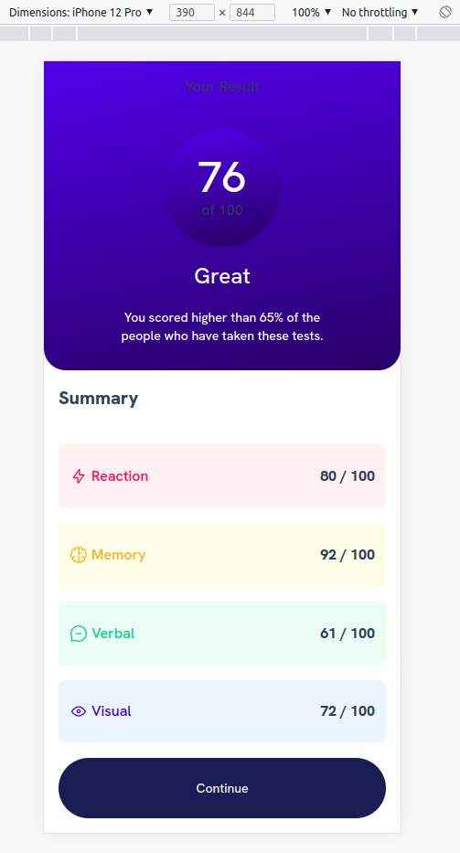
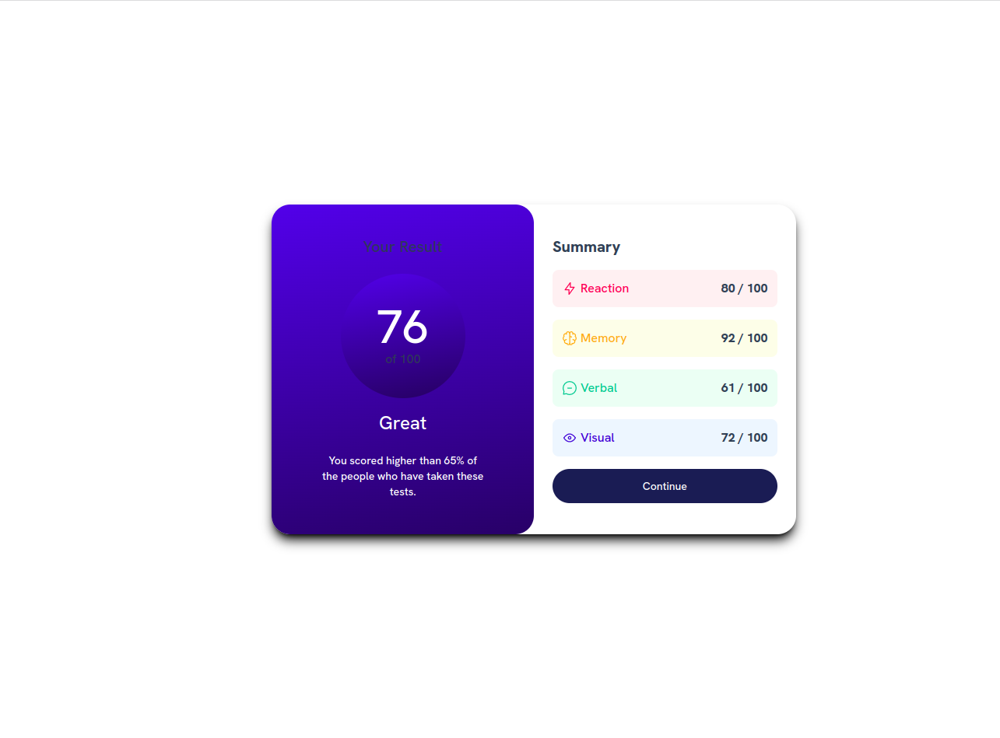

# Frontend Mentor - Results summary component solution

This is a solution to the [Results summary component challenge on Frontend Mentor](https://www.frontendmentor.io/challenges/results-summary-component-CE_K6s0maV). Frontend Mentor challenges help you improve your coding skills by building realistic projects. 

## Table of contents

- [Overview](#overview)
  - [The challenge](#the-challenge)
  - [Screenshot](#screenshot)
  - [Links](#links)
- [My process](#my-process)
  - [Built with](#built-with)
  - [What I learned](#what-i-learned)
  - [Continued development](#continued-development)
  - [Useful resources](#useful-resources)
- [Author](#author)
- [Acknowledgments](#acknowledgments)

**Note: Delete this note and update the table of contents based on what sections you keep.**

## Overview

### The challenge

Users should be able to:

- View the optimal layout for the interface depending on their device's screen size
- See hover and focus states for all interactive elements on the page

### Screenshot




### Links

- Solution URL: [Add solution URL here](https://your-solution-url.com)
- Live Site URL: [Add live site URL here](https://your-live-site-url.com)

## My process

### Built with

- Semantic HTML5 markup
- CSS custom properties
- Flexbox
- CSS Grid
- Mobile-first workflow
- [React](https://reactjs.org/) - JS library
- [TailWind](https://tailwindcss.com/) - CSS framework


### What I learned

The most important thing is to familiarize yourself with TailWind and apply them for faster website creation and mobile design with breakpoints(sm,md,lg,...) without having to configure css.

To see how you can add code snippets, see below:

```html
<div className="flex justify-center items-center h-screen">
```
```html
<div className="h-3/5 md:h-auto md:w-1/2 flex flex-col md:px-2 md:py-10">
}
```
```css
module.exports = {
  content: ["./src/**/*.{html,js}"],
  theme: {
    extend: {
      colors: {
        'dark-gray':  'hsl(224, 30%, 27%)',
        'light-red': 'hsla(0, 100%, 67%)',
        'orangey-yellow': 'hsl(39, 100%, 56%)',
        'green-teal': 'hsl(166, 100%, 37%)',
        'cobalt-blue': 'hsl(234, 85%, 45%)',
        'light-slate-blue': 'hsl(252, 100%, 67%)',
        'blue-dark': '#1e3a8a',
      },
    },
  },
  plugins: [],
}
```

### Continued development

Get acquainted with TailWind and Mobile-first workflow

## Author

- Website - [@vuminhtruong](https://github.com/vuminhtruong)
- Frontend Mentor - [@vuminhtruong](https://www.frontendmentor.io/profile/vuminhtruong)
